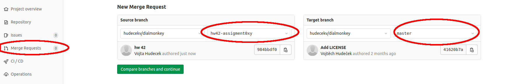

# NPFL099
This is an official base repository for the class [NPFL099 Statistical Dialogue Systems](https://ufal.mff.cuni.cz/courses/npfl099).

You will find the homework assignments and all the related necessary files here.

## Homework Submission Instructions

All homework assignments will be submitted using a Git repository on MFF GitLab.

We provide an easy recipe to set up your repository below:

### Creating the repository


1. Log into your MFF gitlab account. Your username and password should be the same 
    as in the CAS, see [this](https://www.ms.mff.cuni.cz/local/gitlab.html.cz).
2. You'll have a project repository created for you under the 
    [teaching/NPFL099/2023](https://gitlab.mff.cuni.cz/teaching/npfl099/2023) group. 
    The project name will be the same as your CAS username. If you don't see any repository,
    it might be the first time you've ever logged on to Gitlab. In that case, Ondřej
    first needs to run a script that creates the repository for you (please let him know on Slack).
    In any case, you can explore everything in the 
    [base repository](https://gitlab.mff.cuni.cz/teaching/npfl099/base). Your own repo
    will be derived from this one.
3. Clone your repository.
4. Change into the cloned directory and run
```
git remote show origin
```
You should see these two lines:
```
* remote origin
  Fetch URL: git@gitlab.mff.cuni.cz:teaching/NPFL099/2023/your_username.git
  Push  URL: git@gitlab.mff.cuni.cz:teaching/NPFL099/2023/your_username.git

```

5. Add the base repository (with our code, for everyone) as your `upstream`:
```
git remote add upstream https://gitlab.mff.cuni.cz/teaching/NPFL099/base.git
```

6. You're all set!


1. Log into your MFF gitlab account. Your username and password should be the same as in the CAS, see [this](https://www.ms.mff.cuni.cz/local/gitlab.html.en).
2. You'll have a project created for you under the `teaching/NPFL099/2023` group. The project name will be the same as your CAS username.
3. Clone your repository.
4. Change into the cloned directory and run
```
git remote show origin
```
You should see these two lines:
```
* remote origin
  Fetch URL: git@gitlab.mff.cuni.cz:teaching/NPFL099/2023/your_username.git
  Push  URL: git@gitlab.mff.cuni.cz:teaching/NPFL099/2023/your_username.git

```

6. Add the base repository (with our code, for everyone) as your `upstream`:
```
git remote add upstream https://gitlab.mff.cuni.cz/teaching/NPFL099/base.git
```
7. You're all set!


### Submitting your homework assignment

1. Make sure you're on your master branch and it is up-to-date
```
git checkout master && git fetch upstream master && git merge upstream/master master
```

2. Checkout new branch for assigment no. 'X':
```
git checkout -b hwX
```
3. Solve the assignment :)

4. Add new files (if applicable) and commit your changes:
```
git add hwX/solution.py
git commit -am "commit message"
```

5. Push to your *origin* remote repository to a remote branch corresponding to your assignemnt:
```
git push origin hwX
```

6. Create a **Merge request** in the web interface. Make sure you create the merge request into the master branch in your own forked repository (not into the upstream).

        Merge requests -> New merge request



7. Wait a bit till we check your solution, then enjoy your points :)! Usually there will be comment(s) on your MR.
8. Once approved, merge your changes into your master branch – you might need them for further homeworks 
    (but feel free to branch out from the previous homework in your next one if we're too slow with checking).


### Updating from the base repository

You'll probably need to update from the upstream base repository every once in a while (most probably before you start implementing each assignment). We'll let you know when we make changes to the base repo.

To upgrade from upstream, do the following:

1. Make sure you're on your master branch
```
git checkout master
```

2. Fetch the changes
```
git fetch upstream master
```
3. Apply the diff
```
git merge upstream/master master
```


## Installation

The code here requires Python 3 and [pip](https://pypi.org/project/pip/).

For a basic installation, clone the repository and run:
```
cd <your-repo>; pip install [--user] -r requirements.txt
```

However, you probably also want to use the repo as a set of libraries (e.g. import packages from it).
This will be used in some of the test scripts for the individual assignments. Unless you always run
these scripts from your repository's base directory, you can do a full in-place install of 
your cloned repository:
```
cd <your-repo>; pip install [--user] -e .
```

Use `--user` to install into your user directories (recommended unless you're using 
a [virtualenv](https://virtualenv.pypa.io/en/latest/) or [conda](https://docs.conda.io/en/latest/)).


## Automated Tests

You can run some basic sanity checks for some homework assignments (so far, only the first one is imlemented,
we'll let you know if we create more).
Note that the tests require stuff from `requirements.txt` to be installed in your Python environment.
The tests assume checking in the current directory, they assume you have the correct branches set up.

For instance, to check `hw1`, run:

```
./run_tests.py hw1
```

By default, this will just check your local files. If you want to check whether you have
your branches set up correctly, use the `--check-git` parameter.
Note that this will run `git checkout hw1` and `git pull`, so be sure to save any 
local changes beforehand! 

Please always update from upstream before running tests.
Some may only be available at the last minute, we're sorry for that!
